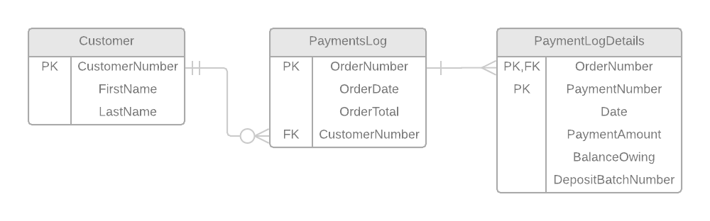

# Normalization: Payments Log
### ESP #2

## 0NF 

PaymentsLog ( FirstName, LastName, OrderDate, CustomerNumber, <b class="pk">OrderNumber</b>, OrderTotal, <b class="gr">{</b> Date, PaymentAmount, PaymentNumber, BalanceOwing, PaymentType, DepositBatchNumber<b class="gr">}</b> )

## 1NF

After performing First Normal Form, a single table was generated: **Payment**

PaymentsLog ( <b class="pk">OrderNumber</b>, CustomerNumber, OrderTotal, OrderDate, CustomerFirstName, CustomerLastName )

Payment ( <b class="pk"><b class="fk">OrderNumber</b>, PaymentNumber</b>, Date, PaymentAmount, BalanceOwing, PaymentType, DepositBatchNumber )

## 2NF

There are no partial dependencies found.

## 3NF

After performing Third Normal Form, a single table was generated: **Customer**

PaymentsLog ( <b class="pk">OrderNumber</b>, <u class="fk">CustomerNumber</u>, OrderDate, OrderTotal )

Payment ( <b class="pk"><u class="fk">OrderNumber</u>, PaymentNumber</b>, Date, PaymentAmount, BalanceOwing, PaymentType,  DepositBatchNumber )

Customer ( <b class="pk">CustomerNumber</b>, FirstName, LastNumber )

## ERD for ESP 2 (before merge)

### Notes:

- PaymentLog entity merged with Order entity from ESP 1.
- OrderTotal attribute from PaymentLog entity updated to 'Total'.

------------------

Other solution:

## 1NF

PaymentsLog (OrderNumber, OrderDate, OrderTotal, FirstName, LastName, CustomerNumber)

Payment ( <b class="pk"><b class="fk">OrderNumber</b>, PaymentNumber</b>, Date, PaymentAmount, BalanceOwing, PaymentType, DepositBatchNumber )

## 2NF

PaymentLog (<b class="pk">OrderNumber</b>s, OrderDate, OrderTotal, FirstName, LastName, CustomerNumber)

PaymentLogDetails (<b class="pk"><u class="fk">OrderNumber</u>, <u class="fk">PaymentID</u></b>, PaymentNumber, BalanceOwing, DepositBatchnumber)

Payment (<b class="tk"><b class="pk">PaymentID</b></b>, Date, PaymentAmount, PaymentType)

-------------------

