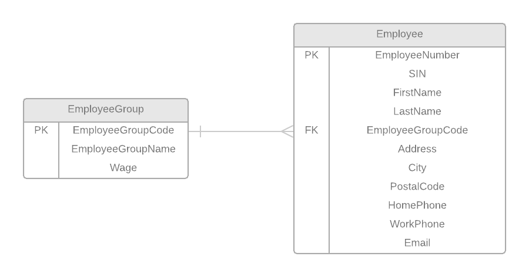

# EMPLOYEE VIEW

## 0NF: List all attributes and make them atomic

After performing Zero Normal Form, a new entity was generated: **_Employee_**

**Employee**: ( <b class="pk">EmployeeNumber</b>, SIN, FirstName, LastName, Address, City, PostalCode, HomePhone, WorkPhone, Email, EmployeeGroupCode, EmployeeGroupName, Wage )

## 1NF: Repeating Groups

After performing First Normal Form, no new entity was generated.

## 2NF: Partial Dependencies

After performing Third Normal Form, a new entity was generated: **_EmployeeGroup_**

**EmployeeGroup**: ( <b class="pk"><u class="fk">EmployeeNumber</u>, EmployeeGroupCode</b>, EmployeeGroupName, Wage )

## 3NF: Transitive Dependencies

After performing Third Normal Form, no new entity was generated.

## Entities After 3NF:

**Employee**: ( <b class="pk">EmployeeNumber</b>, SIN, FirstName, LastName, Address, City, PostalCode, HomePhone, WorkPhone, Email )

**EmployeeGroup**: ( <b class="pk"><u class="fk">EmployeeNumber</u>, EmployeeGroupCode</b>, EmployeeGroupName, Wage )

## ERD
The following ERD represents the tables/entities from the **Employee View**

-------------
