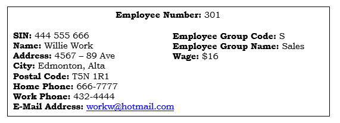
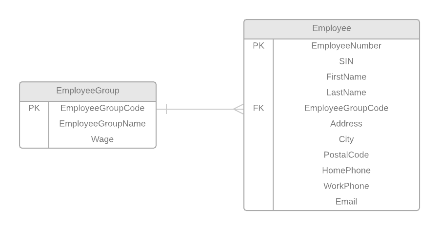
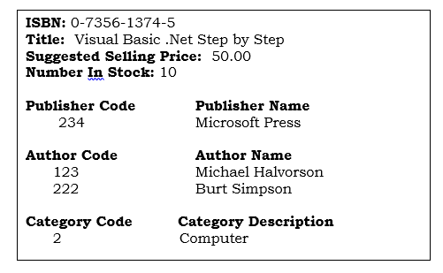
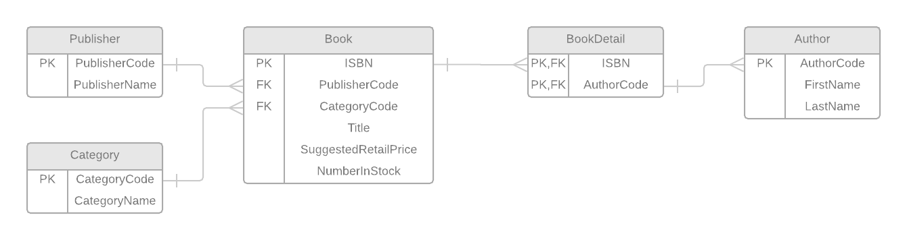
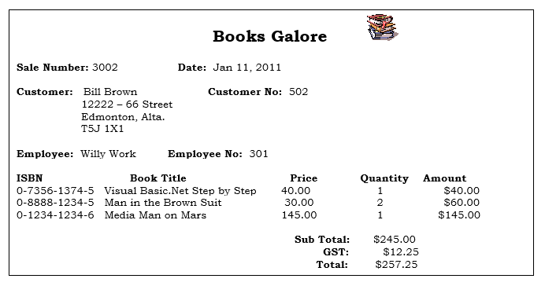
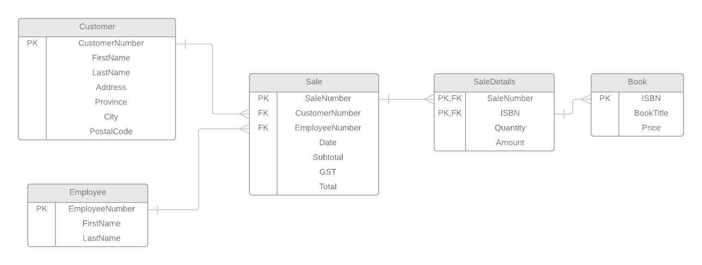

# Books Galore

## EMPLOYEE VIEW

The Employee View and its resulting tables are based on the following form:

### 0NF: List all attributes and make them atomic

After performing Zero Normal Form, a new entity was generated: **_Employee_**

**Employee**: ( <b class="pk">EmployeeNumber</b>, SIN, FirstName, LastName, Address, City, PostalCode, HomePhone, WorkPhone, Email, EmployeeGroupCode, EmployeeGroupName, Wage )

### 1NF: Repeating Groups

After performing First Normal Form, no new entity was generated.

### 2NF: Partial Dependencies

After performing Second Normal Form, no new entity was generated.

### 3NF: Transitive Dependencies

After performing Third Normal Form, a new entity was generated: **_EmployeeGroup_**

**EmployeeGroup**: ( <b class="pk">EmployeeGroupCode</b>, EmployeeGroupName, Wage )

### Entities After 3NF:

Here are the tables/entities after normalizing the Employee View:

**Employee**: ( <b class="pk">EmployeeNumber</b>, SIN, FirstName, LastName, <u class="fk">EmployeeGroupCode</u>, Address, City, PostalCode, HomePhone, WorkPhone, Email )

**EmployeeGroup**: ( <b class="pk">EmployeeGroupCode</b>, EmployeeGroupName, Wage )

### ERD
The following ERD represents the tables/entities from the **Employee View**

--------------

## BOOK TITLE VIEW

The Employee View and its resulting tables are based on the following form:

### 0NF: List all attributes and make them atomic

After performing Zero Normal Form, a new entity was generated: **_Book_**

**Book**: ( <b class="pk">ISBN</b>, Title, SuggestedSellingPrice, NumberInStock, PublisherCode, Publisher Name, <b class="gr">{</b> AuthorCode, AuthorFirstName, AuthorLastName <b class="gr">}</b>, CategoryCode, CategoryDescription )

### 1NF: Repeating Groups

After performing First Normal Form, a new entity was generated: **_BookDetails_**

**BookDetails:** ( <b class="pk"><u class="fk">ISBN</u>, <u class="fk">AuthorCode</u></b>, AuthorFirstName, AuthorLastName )

### 2NF: Partial Dependencies

After performing Second Normal Form, a new entity was generated: **_Author_**

**Author**: ( <b class="pk">AuthorCode</b>, AuthorFirstName, AuthorLastName )

### 3NF: Transitive Dependencies

After performing Third Normal Form, two new entities were generated: **_Publisher_** & **_Category_**

**Publisher**: ( <b class="pk">PublisherCode</b>, PublisherName )

**Category**: ( <b class="pk">CategoryCode</b>, CategoryDescription )

### Entities After 3NF:

Here are the tables/entities after normalizing the Book Title View:

**Book:** ( <b class="pk">ISBN</b>, <u class="fk">PublisherCode</u>, <u class="fk">CategoryCode</u>, Title, SuggestedSellingPrice, NumberInStock )

**BookDetails:** ( <b class="pk"><u class="fk">ISBN</u>, <u class="fk">AuthorCode</u></b> )

**Author:** ( <b class="pk">AuthorCode</b>, AuthorFirstName, AuthorLastName )

**Publisher:** ( <b class="pk">PublisherCode</b>, PublisherName )

**Category:** ( <b class="pk">CategoryCode</b>, CategoryDescription )

### ERD
The following ERD represents the tables/entities from the **Book Title View**

----------------------------

## SALE VIEW

The Employee View and its resulting tables are based on the following form:

### 0NF: List all attributes and make them atomic

After performing Zero Normal Form, a new entity was generated: **_Sale_**

**Sale:** ( <b class="pk">SaleNumber</b>, Date, CustomerFirstName, CustomerLastName, Address, Province, City, PostalCode, CustomerNumber, EmployeeFirstName, EmployeeLastName, EmployeeNumber, <b class="gr">{</b> ISBN, BookTitle, Price, Quantity, Amount <b class="gr">}</b>, Subtotal, GST, Total )

### 1NF: Repeating Groups

After performing First Normal Form, a new entity was generated: **_SaleDetails_**

**SaleDetails:** ( <b class="pk"><u class="fk">SaleNumber</u>, ISBN</b>, BookTitle, Price, Quantity, Amount )

### 2NF: Partial Dependencies

After performing Third Normal Form, a new entity was generated: **_Book_**

**Book:** ( <b class="pk">ISBN</b>, BookTitle, Price )

### 3NF: Transitive Dependencies

After performing Third Normal Form, two new entities were generated: **_Customer_** & **_Employee_**

**Customer:** ( <b class="pk">CustomerNumber</b>, CustomerFirstName, CustomerLastName, Address, Province, City, PostalCode )

**Employee:** ( <b class="pk">Employee</b>, EmployeeFirstName, EmployeeLastName )

### Entities After 3NF:

**Sale:** ( <b class="pk">SaleNumber</b>, <u class="fk">CustomerNumber</u>, <u class="fk">EmployeeNumber</u>, Date, Subtotal, GST, Total)

**SaleDetails:** ( <b class="pk"><u class="fk">SaleNumber</u>, <u class="fk">ISBN</u></b>, Quantity, Amount )

**Book:** ( <b class="pk">ISBN</b>, BookTitle, Price )

**Customer:** ( <b class="pk">CustomerNumber</b>, CustomerFirstName, CustomerLastName, Address, Province, City, PostalCode )

**Employee:** ( <b class="pk">EmployeeNumber</b>, EmployeeFirstName, EmployeeLastName )

## ERD
The following ERD represents the tables/entities from the **Sale View**

-----------------------------
## Merged Entities

To avoid duplicated entities, we merged entities with the same entity name and same primary/foreign keys.

Here are the following merged entities:

- **Employee** from Employee View and **Employee** from Sale View
    - after merging the two tables, a single **Employee** entity was generated:

        **Employee:** ( <b class="pk">EmployeeNumber</b>, SIN, FirstName, LastName, Address, City, PostalCode, HomePhone, WorkPhone, Email )

- **Book** from Book Title View and **Book** from Sale View
    - after merging the two tables, a single **Book** entity was generated:

        **Book:** ( <b class="pk">ISBN</b>, <u class="fk">PublisherCode</u>, <u class="fk">CategoryCode</u>, BookTitle, SuggestedRetailPrice, NumberInStock, SellingPrice)
   
    **Note:** The attribute named "Price" from the entity **Sale View** was changed to "SellingPrice" to avoid confusion.
        
      

## Final Database for Books Galore

-------------

